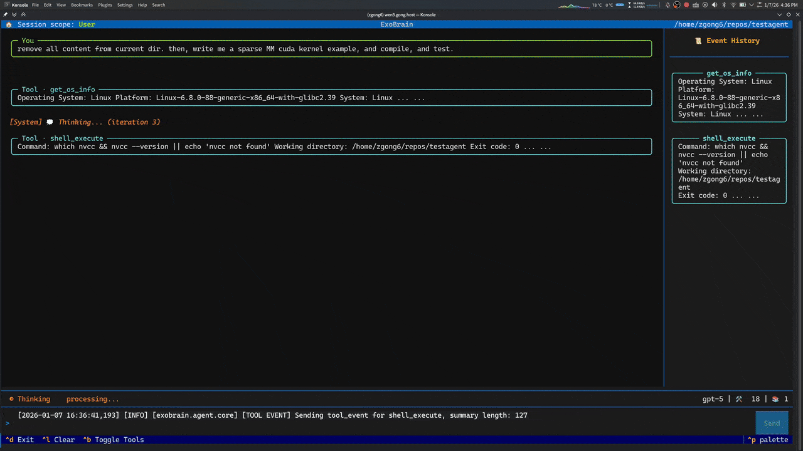

# ExoBrain

A toy AI assistant with tool calling capabilities and file system access, running in your terminal with or without TUI. 




[](https://opensource.org/licenses/MIT)


## Features

- 💻 **TUI Interface** - Terminal UI based on [Textual](https://github.com/Textualize/textual)
- 🤖 **Multi-Model Support** - [OpenAI](https://openai.com/api/), [Gemini](https://aistudio.google.com/), local models (hosted via [vLLM](https://github.com/vllm-project/vllm) etc)
- 🛠️ **Tools** - File operations, web search, shell execution
- 🎨 **Skills System** - Integrated [Anthropic Skills](https://github.com/anthropics/skills.git)
- 🔌 **MCP Support** - Model Context Protocol integration (currently integrated [Context7](https://context7.com/))
- 🔒 **Permission Control** - Fine-grained permission requests and access control
- 💬 **Session Management** - Project-level and global session storage
- 📜 **Constitutional AI** - Customizable behavioral guidelines


The purpose of this project is to experiment with building a modular AI assistant that can integrate multiple models, and tools, with full control and transparency. Only use it for fun, not for production.

## Quick Start

### Installation

Install from pip:

```bash
pip install exobrain
```

Install from source (development):

```bash
git clone https://github.com/visualdust/exobrain.git
cd exobrain

git submodule update --init --recursive

# Install with uv
uv sync

# Or with pip
pip install -e .
```

### Setup

Run the configuration wizard:

```bash
exobrain config init
```

The wizard will guide you through:

- Selecting AI model providers (OpenAI, Gemini, or local models)
- Configuring API keys
- Setting up basic features and permissions

### Usage

```bash
# Start interactive chat
exobrain chat

exobrain chat --no-tui  # Disable TUI interface

# Ask a single question
exobrain ask "Summarize today's news"

# Use verbose mode to see tool execution details
exobrain ask "Search for latest AI news" --verbose

# Use specific model
exobrain chat --model openai/gpt-4o

# Project-level or global sessions
exobrain chat --project   # Store in ./.exobrain/conversations
exobrain chat --global    # Store in ~/.exobrain/data/conversations
exobrain chat --continue  # Continue last session
```

## Configuration

ExoBrain uses a hierarchical configuration system:

1. Project-level config: `./.exobrain/config.yaml` (highest priority)
2. Global config: `~/.config/exobrain/config.yaml`

### Configuration Management

```bash
# View current configuration
exobrain config show

# Edit configuration
exobrain config edit

# Set/get specific values
exobrain config set agent.max_iterations 500
exobrain config get models.default

# Model management
exobrain models list              # List available models
exobrain models use openai/gpt-4o # Set default model
```

### Session Management

```bash
# List all sessions
exobrain sessions list

# Show session details
exobrain sessions show <session-id>

# Delete sessions
exobrain sessions delete <session-id>
exobrain sessions delete --all --yes
```

### Skills System

```bash
# List available skills
exobrain skills list

# Search skills
exobrain skills list --search "pdf"

# Show skill details
exobrain skills show mcp-builder
```

### Constitution (Behavioral Guidelines)

Constitutions define the AI's behavior and ethical guidelines. They are managed as markdown files.

```bash
# Manage constitutions
exobrain constitution list        # List all constitutions
exobrain constitution create      # Create new constitution
exobrain constitution use <name>  # Switch constitution
exobrain constitution edit        # Edit current constitution
```

## Permission System

ExoBrain requests permission for sensitive operations:

- **Once** - Grant for this operation only
- **Session** - Grant for this chat session
- **Always** - Add to config permanently

Example:

```
╭─────────────── Permission Request ───────────────╮
│ ⚠️  Permission Required                          │
│                                                  │
│   Tool      shell_execute                        │
│   Action    Execute shell command                │
│   Resource  git status                           │
│   Reason    Command not in allowed list          │
│                                                  │
│  Grant permission for this action?               │
│                                                  │
│    [y] Yes, once       [n] No                    │
│    [s] Yes, session    [a] Yes, always           │
╰──────────────────────────────────────────────────╯
```

## License

MIT License - see [LICENSE](LICENSE) file for details
